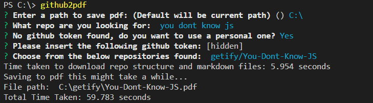

# Github2PDF
Cli tool that allows you to dowload a github repository markdowns as a single pdf.

## Install

Install with [npm](https://www.npmjs.com/):

```sh
$ npm install -g github2pdf
```
---
 ## Steps to run the tool
 

 ## Output
 The output will be a folder named as the owner of the repo and inside it, there will be the pdf named as the repo name.
## Notes
It is recomended to add a personal access token to not be limited by github's api. This can be obtained [here](https://github.com/settings/tokens). If you use this tool frequently you can also add github_token on a .env file in the root of this module.
